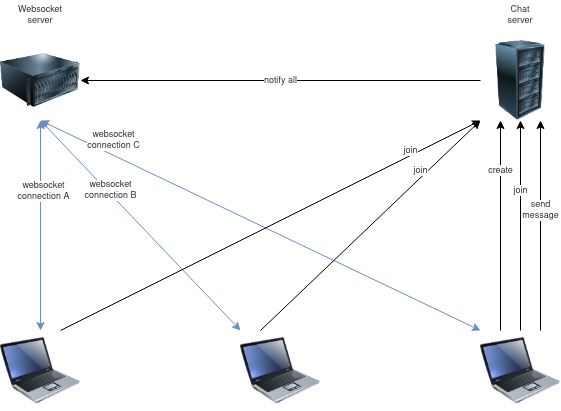
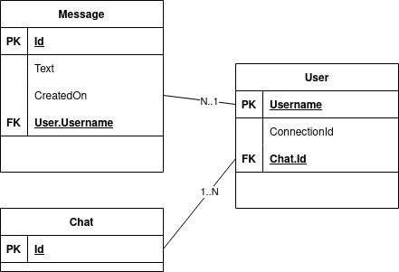

# chat-room
Proyecto del Bootcamp de Back-end de Lemoncode 2022-2023, de una aplicación de Chat donde diferentes usuarios pueden unirse a una sala e intercambiar mensajes.
Se utilizan las siguientes tecnologías, todo ello en una solución que sigue los principios de la Arquitectura Limpia y estrategia de persistencia con ORM y *code first*:
- .NET 7
- Entity Framework Core
- SQL Server
- xUnit (tests unitarios y de integración)
- Moq
- Fluent Assertions
- Autenticación Básica
- Autenticación con OpenID Connect
- Autorización con OAuth2
- Docker
- Swagger/OpenAPI

## Pre-requisitos
- SDK de .NET 7 instalado
- IDE para desarrollo con C# (preferiblemente Visual Studio 2022 Community Edition o JetBrains Rider)
- Docker

## Instrucciones y Requisitos
Se requiere crear una el back-end para una aplicación que permita que diferentes usuarios puedan chatear en tiempo real.


La aplicación se ejecutará en un servidor http, y debe ser capaz de permitir lo siguiente:
1. Crear chats o salas de chat mediante http con un `POST api/chats` que debe devolver un identificador único para el recurso creado.
2. Unir a usuarios en el chat, identificados con un *username* y que cuenten con una dirección única (i.e: *websocket connection ID*) en la que deben poder recibir mensajes en tiempo real desde el servidor con un `POST api/chats/{chat_id}/users`. Se asume que los usuarios no necesitan estar registrados en el sistema para unirse a un chat, y que solamente pueden unirse a un chat.
3. Enviar mensajes al chat mediante http con un `POST api/chats/{chat_id}/users/{username}/messages`.
4. Recibir mensajes del chat en tiempo real mediante websocket en el canal de websocket al que estén conectados. Ver Anexo para la herramienta recomendada `sasw-websocket-tester` que se puede utilizar para gestor de conexiones websocket como si fuera un API Gateway de AWS con soporte de websockets. Si no se utiliza esta herramienta, se deberá programar un endpoint de websockets que gestione todas las conexiones y permita enviar mensajes a cada uno independientemente.
5. Recuperar el historial (i.e: colección) de mensajes de un chat con `GET api/chats/{chat_id}/messages`.

## Parte 1 - Modelo Entidad Relación (ER) y Persistencia en Sql Server con Entity Framework
Toda la información se debe persistir en una base de datos SQL Server de modo que si la aplicación se reinicia, los usuarios puedan seguir chateando. Se ha de utilizar un Object Relational Mapper (ORM) con Entity Framework en su última versión.
Partiremos de un diagrama Entidad Relación sencillo


Los objetivos son los siguientes:
- Generar en *code first* una base de datos `Chats` con un esquema que represente ese modelo Entidad Relación utilizando migraciones de Entity Framework con la herramienta EF CLI.
- Crear servicios que escriban y lean de la base de datos utilizando Entity Framework.
- Crear una API REST que utilice estos servicios para exponer la funcionalidad a través de HTTP.
- Crear un servicio `INotificationService` capaz de dar la orden al gestor de websockets (ver Anexo y herramienta `sasw-websocket-tester`) para que envíe notificaciones/mensajes en tiempo real a los usuarios conectados.
- Añadir Swagger UI para poder interaccionar con la aplicación y testearla manualmente sin necesidad de un cliente front-end.

## Parte 2 - Estructurando Solución con Arquitectura Limpia
La solución debe ser lo más mantenible y testeable posible y se han de utilizar buenas prácticas de separación de responsabilidades con Arquitectura Limpia.

Los objetivos son los siguientes:
- Refactorizar la solución para separar responsabilidades en capas de Dominio, Aplicación e Infraestructura, utilizando el principio de Inversión de Dependencia.
- Evitar que la capa de Dominio y de Infraestructura dependan de una base de datos concreta como SQL Server, de modo que se pueda cambiar un proveedor concreto por otro en el futuro (e.g: Posibilidad de cambiar SQL Server por MySQL o PostgreSQL).

## Parte 3 - Autenticación y Autorización
La solución debe ser segura, para que solamente un administrador pueda crear salas de chat, y solamente usuarios autorizados puedan chatear

Los objetivos son los siguientes:
- Incluir autenticación básica con middleware, que sea configurable.
- Incluir OAuth2 y OpenId Connect para que los usuarios puedan autenticarse en un proveedor de tokens externo, y la API REST sea capaz de confiar en que un usuario es quien dice ser, y darle acceso dependiendo de pólizas.
- Adaptar Swagger UI para que funcione con autenticación.

## Parte 4 - Tests Unitarios y de Integración
La solución debe ser correcta atendiendo a los requisitos de negocio, y debe ser mantenible para evitar cualquier modificación no intencionada de funcionalidad.

Los objetivos son los siguientes:
- Incluir tests unitarios con xUnit, utilizando mocks cuando se requiera.
- Incluir tests de integración con xUnit y Test Server.
- Hacer pruebas deterministas, tanto unitarias como de integración.

Opcionalmente, añade configuración para la *pipeline* CI/CD en GitLab que consiga compilar, ejecutar tests unitarios y de integración 
(levantando un servicio para SQL Server y otro para el websocket tester), y publique una imagen docker que permita ejecutar la aplicación `chat-room`
como un contenedor, inyectándole las variables de entorno que queramos que sobreescriban a las settings.

Solución:
Comienza por un test unitario de capa de aplicación sencillo
```
public class MessageTests
{
    [Fact]
    public void Given_Message_The_Formatted_Text_Is_As_Expected()
    {
        // Given
        var sut =
            new Message
            {
                CreatedBy = "pepe",
                CreatedOn = new DateTime(2022,12,21,10,11,22, 33, DateTimeKind.Utc),
                Text = "Hi! I'm pepe, how are you?"
            };
        var expectedText = "[2022-12-21 10:11:22] pepe says: Hi! I'm pepe, how are you?";

        // When
        var result = sut.FormattedText;

        // Then
        result.Should().Be(expectedText);
    }
}
```

Observa que el test falla porque la implementación no es correcta.

Modifica la implementación para que el texto se formatee correctamente
```
public class Message
{
    public DateTime CreatedOn { get; init; }
    public string CreatedBy { get; init; } = string.Empty;
    public string Text { get; init; } = string.Empty;

    public string FormattedText => 
        $"[{CreatedOn.ToString("yyyy-MM-dd HH:mm:ss")}] {CreatedBy} says: {Text}";
}
```

Vuelve a ejecutar el test y observa que ahora todo es correcto.

Implementa test de integración.
Para utilizar un alias en lugar de localhost, edita (como administrador) el `C:\Windows\System32\drivers\etc\hosts`. Por ejemplo añade la línea:
```
127.0.0.1   sqlserver
```

De esta forma puedes modificar el connection string para que apunte a ese alias
```
"ConnectionStrings": {
    "ChatsDatabase": "Server=sqlserver;Database=Chats;user=sa;password=Lem0nCode!;Encrypt=False"
  },
```
y puedes hacer que la CI/CD en GitLab levante un servicio de SQL Server con ese mismo alias. De esta manera no necesitas hacer cambios para testear en local
o en la CI/CD de GitLab.

Una vez ejecutada la pipeline y generada la imagen Docker y guardada en el container registry de GitLab, puedes levantar la aplicación 
(y opcionalmente sobreescribir settings) con
```
docker run \
    --name chat-room \
    -p 6000:80 \
    -e ConnectionStrings__ChatsDatabase="Server=sqlserver;Database=Chats;user=sa;password=Lem0nCode!;Encrypt=False" \
    -e WebsocketHostUrl="http://localhost:8080" \
    -e BasicAuthentication__Username="guru" \
    -e BasicAuthentication__Password="noestamal" \
    -e LemoncodeSecretWord="aguacate" \
    <path_de_la_imagen>
```


## Anexos 
A continuación se describen herramientas a utilizar y varias utilidades que permitan alcanzar los objetivos para esta aplicación web.

### SQL Server con Docker
Para arrancar un servidor de SQL Server 2019 en local con Docker y credenciales `sa / Lem0nCode!`, ejecuta lo siguiente:
```
docker run -e "ACCEPT_EULA=Y" -e "MSSQL_SA_PASSWORD=Lem0nCode!" -p 1433:1433 --name sqlserver2019 -d mcr.microsoft.com/mssql/server:2019-latest
```

Si hay algún error, se pueden consultar las trazas con `docker logs sqlserver2019` para ver cuál es el error que hace que el contenedor no arranque.

NOTA: Si ya tienes un contenedor, creado previamente, llamado `sqlserver2019`, arráncalo con
```
docker start sqlserver2019
```

NOTA: Opcionalmente instala una extensión en VSCODE llamada SQL Server (mssql) para conectar y ver base de datos.

### Conexión a SQL Server
En visual Studio Community Edition, ve a *View > SQL Server Object Explorer* y crea una nueva conexión a 
Server Name: `localhost`
Authentication: `SQL Server Authentication`
User Name: `sa`
Password: `Lem0nC0de!`
Database Name: `<default>`

### Connection string
Para conectar código con la base de datos, utiliza el siguiente connection string:
```
"Server=localhost;Database=Chats;user=sa;password=Lem0nC0de!;Encrypt=False"
```

NOTA: Este connection string asume que el nombre de la base de datos a utilizar es `Chats`

### Instalación de la herramienta Dotnet EF
Si ya tienes el SDK de .NET 7 (i.e: `dotnet --version` muestra `7.0.100` o superior), instala la CLI de Entity Framework Core con
```
dotnet tool install --global dotnet-ef
```

y compruébalo con
```
dotnet ef --version
```
que debería mostrar algo como
```
Entity Framework Core .NET Command-line Tools
7.0.0
```

Si tenías una versión anterior, la puedes actualizar con
```
dotnet tool update --global dotnet-ef
```

### Migraciones
Al utilizar 
La inicial se crea con
``` 
dotnet ef migrations add Inicial --project src/<project_containing_db_context> --startup-project src/<main_project>
```

Un directoro llamado `Migrations` será automáticamente creado.
Para aplicar las migraciones generadas se ejecuta:
``` 
dotnet ef database update --project src/<project_containing_db_context> --startup-project src/<main_project>
```

### Gestor de websockets
La comunicación en tiempo real para mensajes que van desde un servidor a un agente, se puede implementar de diferentes formas.
El protocolo websocket es más adecuado, en estos casos, que el protocolo http de petición respuesta.
Para simplificar el ejecicio, podemos delegar esta funcionalidad de gestión de conexiones en una API Gateway (como la de AWS) que soporta la apertura de websockets y que permite a un servidor enviar mensajes en cada uno de esos websockets a cada cliente conectado.
Se ha creado un simulador de API Gateway llamado `sasw-websocket-tester` que actúa como el de AWS, y se puede ejecutar como un contenedor Docker.
```
docker run -p 8080:8080 --name sasw-websocket-tester registry.gitlab.com/sunnyatticsoftware/sasw-community/sasw-websocket-tester:latest
```

Más información en el proyecto open-source de [sasw-websocket-tester](https://gitlab.com/sunnyatticsoftware/sasw-community/sasw-websocket-tester).

### Cliente de websocket para consola
Para probar el servidor de websocket, se puede utilizar una herramienta de consola que requiere `NodeJs` y `npm` para instalarse con
```
npm install -g wscat
```

Con esta herramienta se puede abrir un websocket contra un servidor, enviar mensajes y recibirlos. Por ejemplo:
```
wscat -c ws://localhost:8080/ws
```
mostrará `Connected` si se establece conexión con esa URL.