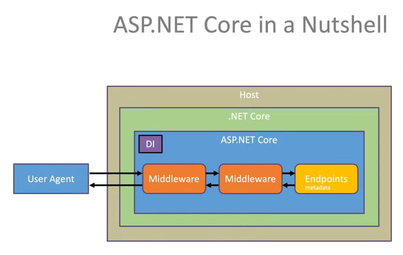

# Agenda Didáctica

## Introducción
El ejercicio `chat-room` se va a trabajar en las unidades didácticas
1. Entity Framework Core
2. Estructura de Soluciones con .NET
3. Autenticación y Autorización
4. Pruebas automatizadas con .NET

Se asume que hay alumnos con diferentes niveles, algunos de los cuales no tienen experiencia previa con .NET o incluso escasa experiencia con programación.

El objetivo de este ejercicio es construir desde cero una aplicación web con relativa complejidad, en la que poder ir añadiendo valor a medida que se profundiza en los conceptos que se van adquiriendo en las diferentes unidades didácticas.

Es totalmente **normal**, y previsible, **que algunos estudiantes no alcancen a comprender todos y cada uno de los conceptos** que se trabajan en las sesiones **en ese mismo momento**. 

En estos casos, el consejo es permanecer tranquilo, evitando abrumarse, e intentar no perder nunca de vista el objetivo ni la motivación. **Todos hemos pasado por ello**. Hay mucho conocimiento en el mundo del software que se va adquiriendo con el tiempo, a veces de manera indirecta, y solo con constancia y trabajo podremos ir conectando esos puntos inconexos para cohesionarlos y dotarlos de sentido.

En otras palabras, hay que dar algún que otro salto de fé temporal, descubrir e identificar los conceptos en los que se requiere profundizar, y pensar que lo que se trabaja en las sesiones quedará grabado y se puede recurrir a ello tantas veces como se desee en iteraciones de *aprender --> practicar --> investigar --> aprender*.

Las sesiones son solamente una parte importante para el aprendizaje, una herramienta más, pero los conocimientos necesitan ponerse en práctica para que ese aprendizaje suceda realmente y sea significativo. Hay que **aprender haciendo**.

¡¡Mucho ánimo a todos!! porque **el camino es largo, no siempre en línea recta, pero es apasionante**.

## Entity Framework Core
En esta unidad didáctica se explora la necesidad que tiene el software de persistir datos para no perder información. El lugar en el que se persisten datos se llama base de datos, y es una pieza fundamental de casi todo sistema software que necesite guardar un estado y recuperarlo en algún momento.

Hay diferentes tipos de bases de datos que se agrupan en relacionales (SQL) y no relacionales (noSQL). A su vez, las no relacionales pueden ser de tipo documental (i.e: MongoDb), de tipo grafo (i.e: Neo4j), de tipo stream (i.e: EventStoreDb), etc.

Nos centraremos en bases de datos relacionales (SQL) y en cómo podemos utilizarlas desde nuestro programa .NET con C# utilizando un Object Relational Mapper (ORM) como Entity Framework, que nos facilita la vida para no tener que utilizar lenguaje SQL y para poder operar sobre el esquema de una base de datos (tablas, filas, columnas, etc.) directamente con código C# como si estuviésemos utilizando objetos y colecciones de objetos.

## Estructura de Soluciones con .NET
En esta unidad didáctica se explora la conveniencia de estructurar nuestras soluciones .NET y los proyectos que contienen, de forma que la dirección de las dependencias sea tenida en cuenta para aplicar el Principio de Inversión de Dependencia (DIP) y conseguir una arquitectura limpia para que haya separación de responsabilidades y la complejidad accidental de la infraestructura no afecte a la lógica de negocio.

## Autenticación y Autorización
En esta unidad didáctica se exploran conceptos de seguridad como Autenticación (asegurarse que alguien es quien dice ser) y Autorización (asegurarse que alguien puede hacer lo que pretende hacer).

Nos centramos en conceptos fundamentales como las diferentes formas que tenemos de guardar datos sensibles como credenciales, la función hash. Se continúa con un tipo de autenticación básica en la que las peticiones http contienen las credenciales para que el servidor las evalúe, y finalizamos por protocolos de autorización como OAuth2 y de autenticación como OpenID Connect.

## Pruebas Automatizadas con .NET
En esta unidad didáctica se explora la necesidad de asegurarse de que el software hace lo que debe hacer y no hace lo que no debe hacer. Además, se explora la necesidad de pruebas automatizadas para evitar regresiones y para permitir un mejor mantenimiento del software.

Se practican pruebas unitarias con xUnit, librerías como Moq y FluentAssertions, y pruebas de integración con xUnit y TestServer, así como estrategias de pruebas de integración.

## Glosario de Conceptos
Durante las sesiones y a lo largo del ejercicio, van a aparecer algunos conceptos que no siempre pueden resultar familiares a todo el mundo. La clave está en entender la idea general, en preguntar (mucho), y en identificarlos para trabajarlos en diferido antes de visualizar de nuevo los vídeos de las sesiones y revisar los ejercicios que se han ido haciendo. 

A continuación se exponen y resumen algunos conceptos importantes en los que poder profundizar individualmente y que formarán, tarde o temprano, del bagaje cultural de todo desarrollador software.

### El protocolo http
Un protocolo, tanto en el mundo del software como en la vida misma, es una manera de actuar, una secuencia de comportamiento. 

Por ejemplo, el protocolo al conocer a una persona es saludar y darse la mano. El protocolo para hacer preguntas o dar respuestas en una clase de primaria es que el alumno levante la mano y el docente deje de hablar para darle paso, etc.

En redes y software, los protocolos también son una serie de reglas para que la información fluya de forma estandarizada. El protocolo http es la forma en la que se intercambian datos en la web, y sirve para comunicar un cliente (e.g: un navegador web como Firefox o Chrome) y un servidor (e.g: un servidor web o back-end). El protocolo http es unidireccional, y consiste en un cliente iniciando siempre la comunicación (i.e: petición o *request*), y un servidor contestando (i.e: respuesta o *response*). 

Una petición consiste en que un cliente envía un mensaje con un verbo (el tipo de mensaje) http, como GET, POST, DELETE, PUT, etc., a una URL concreta, acompañado de cabeceras (metadatos o datos sobre los propios datos) y opcionalmente de un cuerpo (e.g: JSON). La respuesta consistiría en 

Hay otros protocolos diferentes a http, como por ejemplo el protocolo *websocket*, que se utiliza para escenarios en los que la comunicación puede iniciarse desde el lado del servidor.

Algunos recursos de interés:
- [qué es el protocolo http](https://keepcoding.io/blog/que-es-el-protocolo-http)
- [vídeo sobre qué es el protocolo http](https://www.youtube.com/watch?v=G0Ui6z34MOY)
- [verbos http](https://ftpdocs.broadcom.com/cadocs/0/CA%20AppLogic%203%207-ESP/Bookshelf_Files/HTML/AppLogicDoc/1937891.html)
- [cabeceras http](https://www.ionos.es/digitalguide/hosting/cuestiones-tecnicas/cabecera-http/)
- [qué es REST](https://openwebinars.net/blog/que-es-rest-conoce-su-potencia/)
- [qué es JSON](https://www.ticarte.com/contenido/que-es-json)
- [qué es el protocolo websocket](https://codigofacilito.com/articulos/que-son-websockets)

### Contenedor de Dependencias
La inyección de dependencias permite pasar como argumento a un método o constructor, una instancia de un servicio que se necesita utilizar o en el que se necesita delegar algo. 

Hablamos de dependencia cuando un objeto depende de otro. Se puede depender de algo porque un objeto crea otro y, por tanto, conoce su tipo, o porque un objeto *recibe* otro objeto (se le inyecta) y, por tanto, conoce su tipo.

La instanciación de clases (i.e: creación de objetos en memoria con `new`) se considera una responsabilidad por sí misma que se puede extraer. En otras palabras, un objeto podría querer utilizar otro, pero podría no querer tener la responsabilidad de instanciar o saber cómo se instancia ese otro objeto. Un contenedor de dependencias es una estructura de datos de tipo clave/valor, que se encarga de instanciar clases (crear objetos) con un determinado ciclo de vida (e.g: singleton, transient, scoped, etc.) cuando se requieran.

Algunos recursos de interés:
- [qué es la inyección de dependencias y el contenedor DI](https://www.campusmvp.es/recursos/post/que-es-la-inyeccion-de-dependencias-y-como-funciona.aspx)
- [inserción de dependencias en aspnetcore](https://learn.microsoft.com/es-es/aspnet/core/fundamentals/dependency-injection?view=aspnetcore-7.0)

### ASP.NET y Middlewares
ASP.NET Core es un framework de .NET Core para la creación de middlewares (software intermedio) y endpoints capaces de responder a peticiones http. El framework también incluye otras herramientas como un contenedor de dependencias en el que se pueden registrar servicios para utilizarse durante la ejecución de la aplicación.

Algunos recursos de interés:
- [qué es aspnetcore](https://learn.microsoft.com/es-es/aspnet/core/introduction-to-aspnet-core?view=aspnetcore-7.0)
- [middleware de aspnetcore](https://learn.microsoft.com/es-es/aspnet/core/fundamentals/middleware/?view=aspnetcore-7.0)